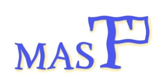

<div align="center">
  
# MAST
Metallic Amorphous Structures Toolkit


<p align="center">
  
</p>


<p>
MAST is a versatile framework for generating Special Glass Structures (SGS) that reproduce target structural descriptors—e.g., pair-distribution functions (PDFs) and angular-distribution functions (ADFs)—enabling large-scale simulations of amorphous networks.
</p>

</div>

---

## Installation

### Prerequisites

- CMake ≥ 3.10
- C++14 compatible compiler (e.g., GCC, Clang)
- ATAT (any version)
  
### Build Instructions

Edit the Makefile:
1. INCDIRS    = -I$(HOME)/atat/src    # change that to the "atat/src" path
2. EXTERNAL_OBJS := $(HOME)/atat/src/getvalue.o      # change that to the "atat/src/" path
   
```sh
make install
```
